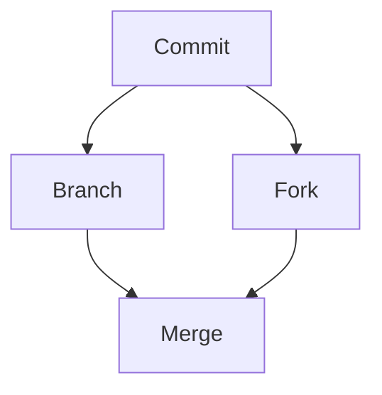

# learning-github

- Demo Repo for Learning GitHub 
- Notes and linked screencasts on dev.to
- Topics listed [here](https://github.com/lynnlangit/learning-github/blob/master/TOPICS.md)

## Example Graphs

Using `mermaid` notation. Live editor to create diagram syntax at this location --> https://mermaid-js.github.io/.  
First example shown below is a flow chart.



---
Second example is a user journey.

```mermaid
journey
    title My working day
    section Go to work
      Make tea: 5: Me
      Go upstairs: 3: Me
      Do work: 1: Me, Cat
    section Go home
      Go downstairs: 5: Me
      Sit down: 3: Me
  ```    
  
  ---
  Third example is a sequence diagram.
  
  ```mermaid
  sequenceDiagram
    Alice->>+John: Hello John, how are you?
    Alice->>+John: John, can you hear me?
    John-->>-Alice: Hi Alice, I can hear you!
    John-->>-Alice: I feel great!
  ```
  
  
