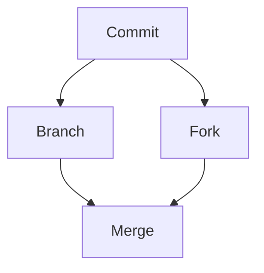

# learning-github

- Demo Repo for Learning GitHub 
- Notes and linked screencasts on dev.to
- Topics listed [here](https://github.com/lynnlangit/learning-github/blob/master/TOPICS.md)

## Example Graph 

Using `mermaid` notation

